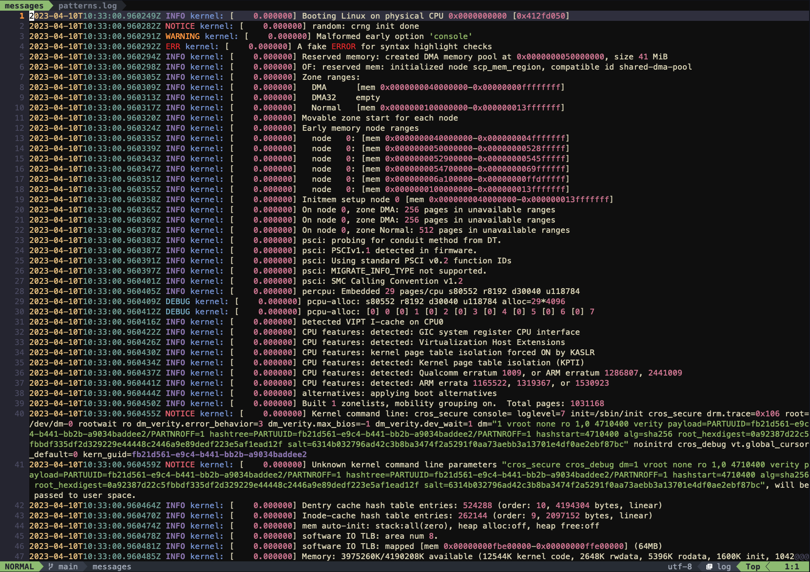
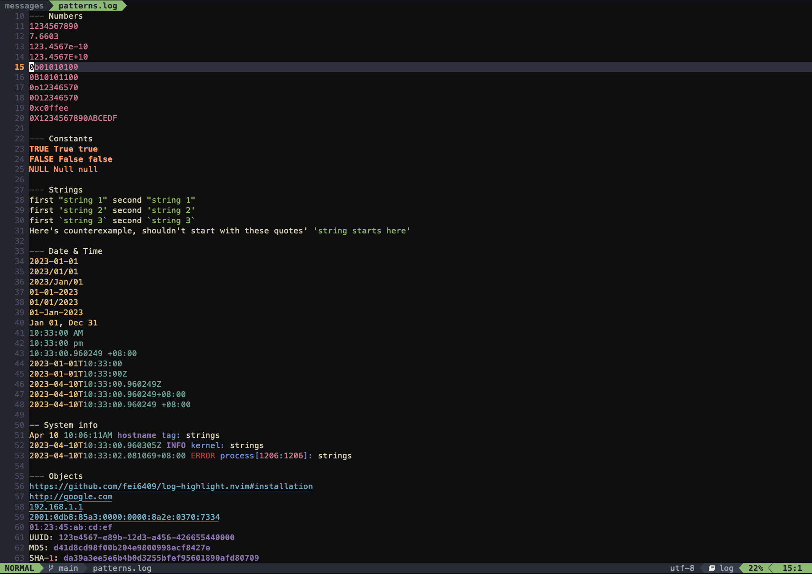

# log-highlight.nvim

A simple and lightweight Neovim plugin that brings syntax highlighting to
generic log files and provides straight-forward configuration to manage the log
filetype detection.





### Note

Although this plugin is still working in progress, the major features are in
place already.  
Feel free to give it a try by following the [installation](#installation) and
[configuration](#configuration).

Missing syntax highlighting will be added sooooon (based on the logs I read or
find).  
More detailed documentation is on the way (though not much to say given this
plugin is quite simple).  

## Installation

Use your favorite plugin manager to download and configure the plugin:

### [lazy.nvim](https://github.com/folke/lazy.nvim)

```lua
{
    'fei6409/log-highlight.nvim',
    config = function()
        require('log-highlight').setup {}
    end,
},
```

### [packer.nvim](https://github.com/wbthomason/packer.nvim)

```lua
use {
    'fei6409/log-highlight.nvim',
    config = function()
        require('log-highlight').setup {}
    end,
},
```

### [vim-plug](https://github.com/junegunn/vim-plug)

```lua
Plug 'fei6409/log-highlight.nvim'
```

Don't forget to add `syntax on` in your `.vimrc`, `init.vim` or `init.lua` to
allow syntax highlighting to work.

## Configuration

### Neovim

This plugin makes use of Neovim's built-in [filetype
detection](https://neovim.io/doc/user/filetype.html) mechanism.  

By default, `log` filetype will apply to files with `log` extension (e.g.
`sys.log`, `my_log` etc.) after setting up.

You can customize the filetype detection patterns like below:

```lua
require('log-highlight').setup {
    -- The following options support either a string or a table of strings.

    -- The file extensions.
    extension = 'log',

    -- The file names or the full file paths.
    filename = {
    },

    -- The glob patterns, e.g. `.*%.lg`, `/var/log/.*`.
    -- Note: `%.` is to match a literal dot (`.`) in a pattern in Lua, but most
    -- of the time `.` and `%.` here make no observable difference.
    pattern = {
    },
}
```

### Vim

By default, `log` filetype will apply to files if the name matches `*.log` or
`*_log`.  

To allow more customized patterns, add autocommands in your `.vimrc` like below.

```vim
" Example:
autocmd BufNewFile,BufRead  /var/log/*  set filetype=log
```

## Release Notes

- v0.0.1: Initial release

## Contributing

Bug reports, feature requests and pull requests are welcome.  
Please also consider attaching a snippet of the log patterns when doing so.

If you're sending pull requests, please also consider adding the log samples in
`samples/`:
- For atomic patterns or smaller pieces, add them to `patterns.log`.
- For longer snippets of real-world logs, create a new log file.

That would be helpful for me to examine if new changes break any existing syntax
highlighting.
