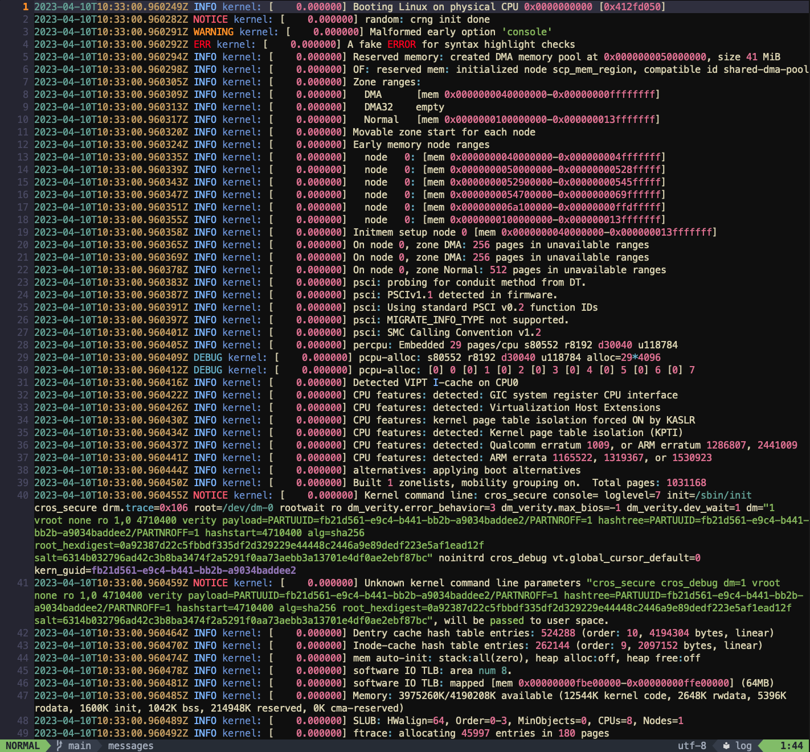
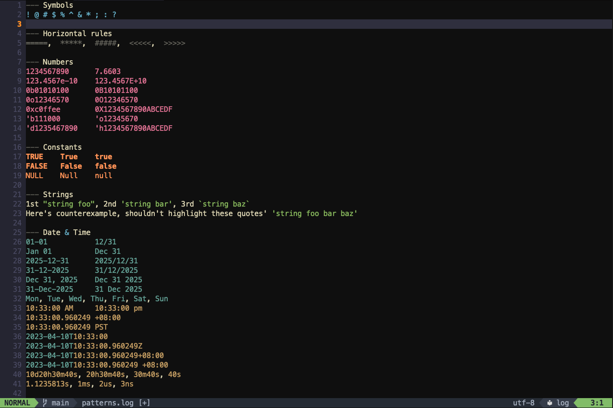
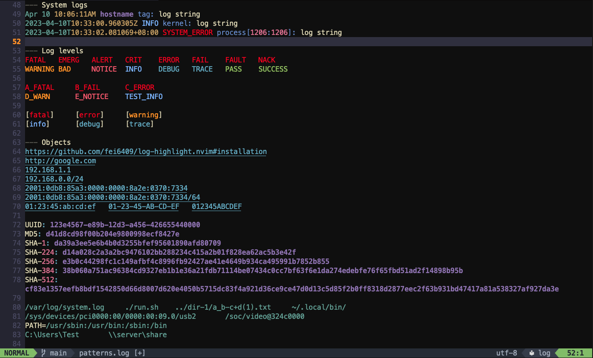

# log-highlight.nvim

A simple and lightweight Neovim plugin that brings syntax highlighting to
generic log files and provides straightforward configuration to manage filetype
detection rules and custom keyword highlighting for your logs.







## Installation

Use your favorite plugin manager to install the plugin.

### [lazy.nvim](https://github.com/folke/lazy.nvim)

```lua
{
    'fei6409/log-highlight.nvim',
    opts = {},
},
```

### [vim-plug](https://github.com/junegunn/vim-plug)

```vim
Plug 'fei6409/log-highlight.nvim'
```

Don't forget to add `syntax on` in your `.vimrc`, `init.vim`, or `init.lua` to
enable syntax highlighting.

## Configuration

### Neovim

This plugin uses Neovim's built-in
[filetype detection](https://neovim.io/doc/user/filetype.html) mechanism.

By default, the `log` filetype is only applied to files with `.log` extension
(e.g., `sys.log`) after setup.

To further configure filetype detection rules and other options:

```lua
require('log-highlight').setup {
    ---@type string|string[]: File extensions. Default: 'log'
    extension = 'log',

    ---@type string|string[]: File names or full file paths. Default: {}
    filename = {
        'syslog',
    },

    ---@type string|string[]: File name/path glob patterns. Default: {}
    pattern = {
        -- Use `%` to escape special characters and match them literally.
        '%/var%/log%/.*',
        'console%-ramoops.*',
        'log.*%.txt',
        'logcat.*',
    },

    ---@type table<string, string|string[]>: Custom keywords to highlight.
    ---This allows you to define custom keywords to be highlighted based on
    ---the group.
    ---
    ---The following highlight groups are supported:
    ---    'error', 'warning', 'info', 'debug' and 'pass'.
    ---
    ---The value for each group can be a string or a list of strings.
    ---All groups are empty by default. Keywords are case-sensitive.
    keyword = {
        error = 'ERROR_MSG',
        warning = { 'WARN_X', 'WARN_Y' },
        info = { 'INFORMATION' },
        debug = {},
        pass = {},
    },
}
```

### Vim

By default, the `log` filetype is applied to files matching `*.log` or `*_log`.

You can customize filetype rules by adding autocommands to `.vimrc` like this:

```vim
autocmd BufNewFile,BufRead /var/log/* set filetype=log
```

## Release Notes

- v1.2.1: Fix bug that may write the syntax file in directory with no permission
- v1.2.0: Allow keyword customization in selected range
- v1.1.0: Add more pattern highlighting to log levels, date & time, hex numbers,
  MAC addresses, and Windows and POSIX paths
- v1.0.1: Add support for [spdlog](https://github.com/gabime/spdlog)-style and
  lowercase log levels
- v1.0.0: Perform minor cleanup and mark official release
- v0.0.2: Add more support for HDL
- v0.0.1: Initial release

## Contributing

Bug reports, feature requests, and pull requests are welcome. When opening an
issue or PR, please consider attaching a snippet of the relevant log pattern.

If you are submitting a pull request, please also consider adding new log
samples to the `samples/` directory:

- For atomic patterns or small snippets, add them to `patterns.log`.
- For longer, real-world log examples, create a new file.

This helps verify that new changes do not break existing syntax highlighting.

## Acknowledgements

- [vim-log-highlighting](https://github.com/MTDL9/vim-log-highlighting) by MTDL9
- [Built-in messages.vim](https://github.com/vim/vim/blob/master/runtime/syntax/messages.vim)

## License

This project is licensed under the [MIT License](LICENSE).
